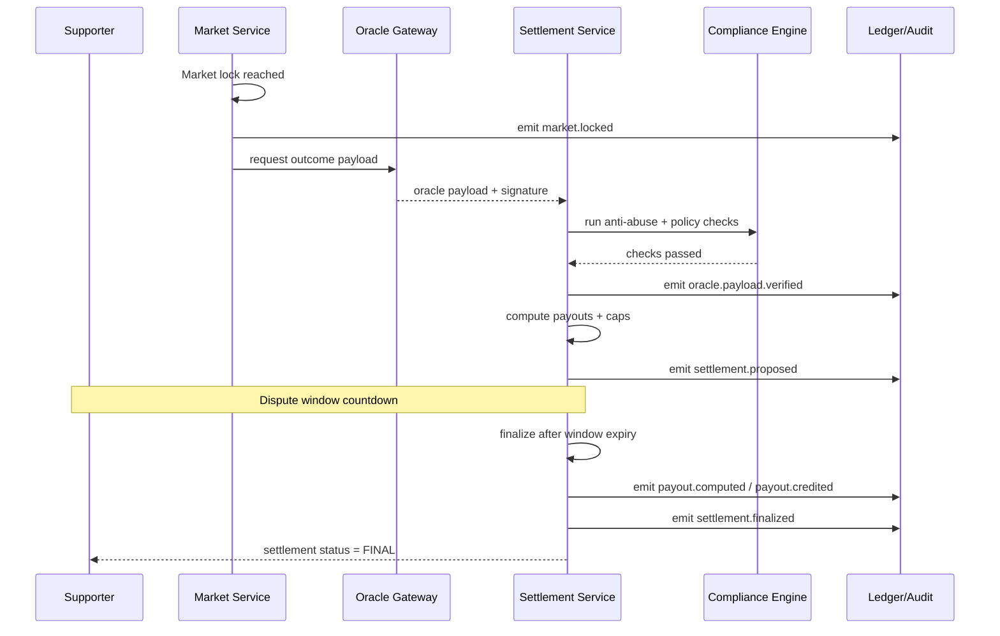
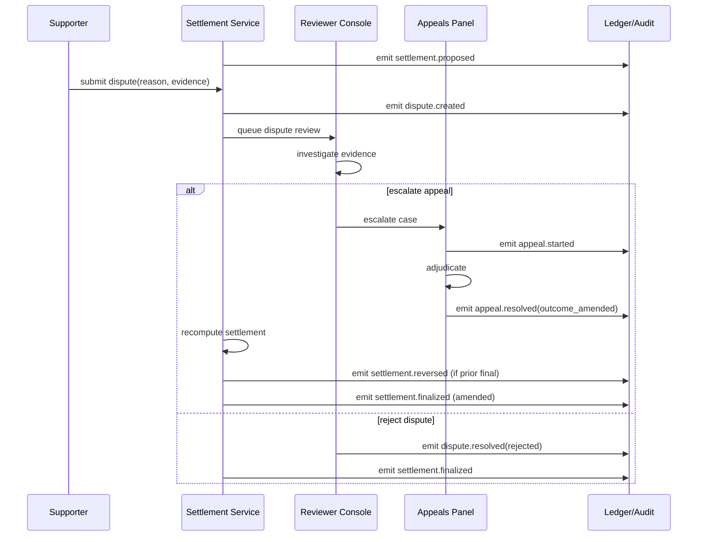
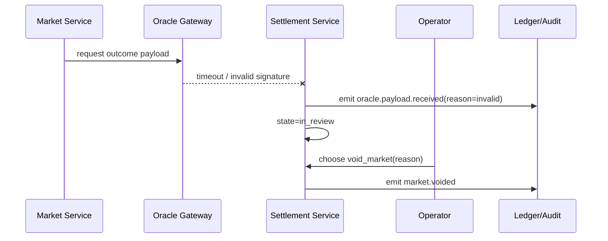

# Vendor Hype + Operations Funding + Prediction
## Oracle-Driven Settlement Workflows (Market Settlement Engineering)

**Role perspective:** Market Settlement Engineer  
**Primary references:**
- `docs/VENDOR_HYPE_OPERATIONS_PREDICTION_WHITEPAPER.md`
- `docs/VENDOR_HYPE_OPERATIONS_PREDICTION_IMPLEMENTATION_PLAN.md`
- `docs/VENDOR_HYPE_OPERATIONS_PREDICTION_BACKEND_ARCHITECTURE.md`
- `docs/VENDOR_HYPE_OPERATIONS_PREDICTION_COMPLIANCE_POLICY_MATRIX.md`

---

## 1) Scope and Goals

This design defines robust settlement workflows for measurable event prediction markets with oracle-driven outcomes, including:
- market lifecycle states and transitions,
- settlement finality model,
- dispute and appeals handling,
- payout capping logic,
- anti-abuse checks,
- audit log schema,
- sequence diagrams and implementation checklist.

### Assumptions
- Phase B supports non-cash points markets; cash mode compatibility is included as forward-compatible logic.
- Outcomes are based on objective, measurable events tied to approved oracle sources.
- All settlement writes are idempotent and auditable.

---

## 2) Market Lifecycle States

### 2.1 Canonical States

```ts
type MarketState =
  | "draft"
  | "scheduled"
  | "open"
  | "locked"
  | "oracle_pending"
  | "in_review"
  | "proposed_settlement"
  | "dispute_open"
  | "finalized"
  | "appeal_review"
  | "reversed"
  | "voided";
```

### 2.2 State Intent
- `draft`: market definition being authored.
- `scheduled`: approved, waiting for open time.
- `open`: participants can place positions.
- `locked`: no new positions; event outcome pending.
- `oracle_pending`: awaiting oracle payload within SLA.
- `in_review`: oracle payload received; pre-settlement checks running.
- `proposed_settlement`: provisional result published with dispute window.
- `dispute_open`: at least one valid dispute filed.
- `finalized`: settlement final and credited.
- `appeal_review`: escalation after dispute decision.
- `reversed`: finalized result revoked and compensated.
- `voided`: market canceled without normal settlement.

### 2.3 Allowed Transitions

```text
draft -> scheduled -> open -> locked -> oracle_pending -> in_review -> proposed_settlement -> finalized
                                                          \-> voided
proposed_settlement -> dispute_open -> finalized
proposed_settlement -> dispute_open -> appeal_review -> finalized
finalized -> reversed -> finalized
locked -> voided
in_review -> voided
```

### 2.4 Transition Guards
- `open -> locked`: triggered at lock timestamp or operator lock action.
- `locked -> oracle_pending`: immediate on lock completion.
- `oracle_pending -> in_review`: only with signed oracle payload from approved source.
- `in_review -> proposed_settlement`: all anti-abuse and policy checks pass.
- `proposed_settlement -> finalized`: dispute window elapsed and no blocking disputes.
- `* -> voided`: operator action with reason code + compliance confirmation.
- `finalized -> reversed`: requires incident case + approver authorization.

---

## 3) Settlement Finality Model

### 3.1 Finality Levels

| Level | State | Meaning | User Visibility |
|---|---|---|---|
| F0 | `proposed_settlement` | Provisional outcome, can still change | “Pending finality” badge |
| F1 | `finalized` | Final settlement, credits applied | “Final” badge + timestamp |
| F2 | `reversed` | Prior finality revoked, compensations posted | “Reversed” badge + incident ref |

### 3.2 Finality Rules
1. Exactly one active `proposed_settlement` per market at a time.
2. Exactly one active `finalized` settlement per market at a time.
3. Finalization requires:
   - anti-abuse checks complete,
   - payout computation hash persisted,
   - dispute timer elapsed or all disputes resolved.
4. Reversal is forward-only:
   - prior final remains immutable,
   - compensation entries are appended.

### 3.3 Finality SLA Targets
- Oracle ingestion after lock: p95 < 5 minutes (or explicit SLA per market template).
- Proposed settlement publication after oracle receipt: p95 < 2 minutes.
- Finalization after dispute window close: p95 < 3 minutes.

---

## 4) Dispute Window and Appeals Flow

### 4.1 Dispute Window
- Opens when `proposed_settlement` is published.
- Configurable duration per market template (default: 24h for non-cash, jurisdiction-dependent for cash).
- Eligible dispute reasons:
  - incorrect oracle source,
  - timestamp mismatch,
  - rule interpretation mismatch,
  - suspected manipulation signal.

### 4.2 Dispute Workflow
1. User/operator files dispute with evidence URI and reason code.
2. System validates dispute eligibility (window open, market state, identity constraints).
3. Market transitions to `dispute_open` if first valid dispute.
4. Reviewer triages:
   - `reject_dispute` (insufficient evidence),
   - `accept_dispute` (trigger resettlement or void),
   - `escalate_appeal` (complex or high-impact case).
5. Disposition recorded in immutable audit timeline.

### 4.3 Appeals Flow
- Appeals can be initiated by:
  - compliance reviewer,
  - designated operator approver,
  - regulator-triggered action.
- Market enters `appeal_review`.
- Appeals panel outcome options:
  - uphold original proposed/finalized outcome,
  - amend outcome and resettle,
  - void market.
- Every appeal decision must include:
  - adjudicator identity,
  - reason code,
  - evidence references,
  - policy version used.

### 4.4 Dispute/Appeal SLAs
- Dispute acknowledgment: <= 1 hour.
- Initial review decision: <= 24 hours.
- Appeal decision (if escalated): <= 72 hours.
- User-facing status updates: near-real-time on decision changes.

---

## 5) Payout Capping Logic

### 5.1 Core Inputs
- `stake_amount`
- `odds_or_pool_ratio`
- `market_cap_config` (per user, per market, per cohort)
- `mode` (`non_cash` points vs cash)
- `reserve_available`

### 5.2 Capping Hierarchy (applied in order)
1. **Position-level cap**: max payout per position.
2. **User-level market cap**: total payout cap for a user in a market.
3. **Market-level payout cap**: aggregate payout ceiling.
4. **Reserve-availability cap**: cannot exceed available settlement reserve.
5. **Jurisdiction cap** (if cash mode): legal maximum exposure limits.

### 5.3 Formula (generic)

```ts
rawPayout = settlementFormula(position, marketOutcome)
positionCapped = min(rawPayout, position.max_payout)
userCapped = min(positionCapped, userMarketRemainingCap)
marketCapped = min(userCapped, marketRemainingPayoutCap)
reserveCapped = min(marketCapped, reserveRemaining)
finalPayout = roundByPolicy(reserveCapped)
```

### 5.4 Non-Cash Specifics (Phase B)
- `stake_unit = points`
- final payout credited as points/badges only.
- no monetary conversion in settlement path.

### 5.5 Overflow Handling
If calculated payout exceeds constraints:
- store `cap_applied=true`,
- persist `cap_reason` (`POSITION_CAP`, `MARKET_CAP`, `RESERVE_CAP`, etc.),
- expose capped reason in user settlement detail UI.

---

## 6) Anti-Abuse Checks

### 6.1 Pre-Settlement Checks (Blocking)
1. **Oracle integrity check**
   - source signature validation
   - expected schema checksum
2. **Market integrity check**
   - no post-lock market rule mutations
   - lock timestamp consistency
3. **Position integrity check**
   - no duplicate position IDs
   - no idempotency collisions
4. **Exposure check**
   - cap compliance and reserve sufficiency
5. **Compliance gate check**
   - mode/jurisdiction still valid at settlement time

### 6.2 Post-Settlement Monitoring (Non-blocking but alerting)
- abnormal win-rate clustering
- coordinated account behavior
- repeated disputes by linked entities
- suspicious manual override frequency

### 6.3 Anti-Abuse Outcomes
- pass: continue to finalization
- soft fail: move to `dispute_open` with system-generated flag
- hard fail: move to `in_review` or `voided` pending operator/compliance decision

### 6.4 Standard Abuse Reason Codes
- `ABUSE_ORACLE_INTEGRITY_FAIL`
- `ABUSE_POST_LOCK_MUTATION`
- `ABUSE_IDEMPOTENCY_COLLISION`
- `ABUSE_EXPOSURE_LIMIT_BREACH`
- `ABUSE_BEHAVIORAL_CLUSTER_FLAG`

---

## 7) Audit Log Schema

### 7.1 Event Envelope
```ts
interface SettlementAuditEvent {
  event_id: string;
  market_id: string;
  settlement_id?: string;
  event_type:
    | "market.locked"
    | "oracle.payload.received"
    | "oracle.payload.verified"
    | "settlement.proposed"
    | "dispute.created"
    | "dispute.resolved"
    | "appeal.started"
    | "appeal.resolved"
    | "settlement.finalized"
    | "settlement.reversed"
    | "market.voided"
    | "payout.computed"
    | "payout.credited"
    | "payout.failed";
  event_time: string; // UTC ISO
  actor_type: "system" | "supporter" | "operator" | "compliance";
  actor_id?: string;
  jurisdiction_code?: string;
  mode: "non_cash" | "sweepstakes" | "regulated_cash";
  policy_version: string;
  reason_code?: string;
  payload: Record<string, unknown>;
  correlation_id: string;
  causation_id?: string;
  hash_prev?: string;
  hash_curr: string;
}
```

### 7.2 Required Payload Fragments by Event
- `oracle.payload.received`: `oracle_source`, `payload_hash`, `observed_at`
- `settlement.proposed`: `outcome_key`, `dispute_window_end`, `calc_hash`
- `dispute.created`: `dispute_id`, `reason_code`, `evidence_uri`
- `settlement.finalized`: `finalized_at`, `payout_batch_id`, `entry_count`
- `settlement.reversed`: `incident_id`, `reversal_batch_id`, `reversal_reason`

### 7.3 Integrity and Retention
- append-only storage with hash-chain continuity checks.
- retention minimum: 7 years for settlement-critical events.
- export formats: JSON/CSV/PDF for compliance requests.

---

## 8) Sequence Diagrams

### 8.1 Happy Path: Lock -> Oracle -> Proposed -> Finalized



### 8.2 Dispute + Appeal + Resettlement Path



### 8.3 Oracle Failure / Void Flow



---

## 9) Implementation Checklist

### 9.1 Domain + State Management
- [ ] Add state enum expansion: `oracle_pending`, `proposed_settlement`, `dispute_open`, `appeal_review`, `reversed`.
- [ ] Implement explicit transition guards and reason codes.
- [ ] Persist dispute-window timestamps on settlement proposal.

### 9.2 Oracle Integration
- [ ] Enforce source allowlist and signature verification.
- [ ] Store payload hash + raw evidence URI.
- [ ] Implement retry/backoff and dead-letter handling for oracle ingestion.

### 9.3 Settlement Engine
- [ ] Implement deterministic payout calculator with cap hierarchy.
- [ ] Support exactly-once finalization with idempotency key + unique constraints.
- [ ] Write payout batch and settlement records atomically.

### 9.4 Disputes and Appeals
- [ ] Create dispute APIs and reviewer workflow.
- [ ] Add appeal escalation and adjudication outcome model.
- [ ] Implement resettlement/void compensation paths.

### 9.5 Anti-Abuse + Compliance
- [ ] Add blocking pre-settlement checks.
- [ ] Add post-settlement anomaly jobs and alert routing.
- [ ] Enforce jurisdiction/mode policy check at settlement finalization.

### 9.6 Audit + Observability
- [ ] Emit canonical audit events with hash-chain fields.
- [ ] Attach correlation/causation IDs across settlement pipeline.
- [ ] Build audit export endpoint and integrity verification tool.

### 9.7 Testing
- [ ] Unit tests for transition guards, cap logic, and dispute timers.
- [ ] Integration tests for happy path, dispute path, and reversal path.
- [ ] Concurrency tests for double-finalize race conditions.
- [ ] Chaos tests for oracle delays/timeouts.

### 9.8 Operations Readiness
- [ ] Define runbooks for stuck markets, oracle outages, and reversal incidents.
- [ ] Define SLA dashboards (oracle latency, finalization latency, dispute backlog).
- [ ] Complete compliance sign-off for event retention and exportability.

---

## 10) Suggested API Surface (Settlement-Specific)

### Store
- `GET /store/predictions/markets/:id/settlement`
- `POST /store/predictions/markets/:id/disputes`
- `GET /store/predictions/markets/:id/disputes/:disputeId`

### Admin/Operator
- `POST /admin/predictions/settlements/:marketId/ingest-oracle`
- `POST /admin/predictions/settlements/:marketId/propose`
- `POST /admin/predictions/settlements/:marketId/finalize`
- `POST /admin/predictions/settlements/:marketId/reverse`
- `POST /admin/predictions/markets/:marketId/void`

### Compliance/Appeals
- `POST /admin/compliance/disputes/:disputeId/resolve`
- `POST /admin/compliance/disputes/:disputeId/escalate-appeal`
- `POST /admin/compliance/appeals/:appealId/decide`
- `GET /admin/compliance/markets/:marketId/audit-events`

